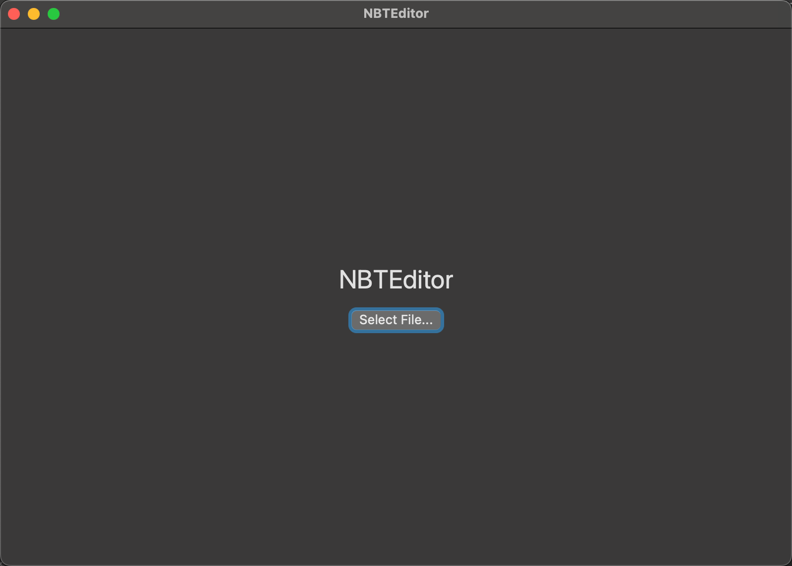
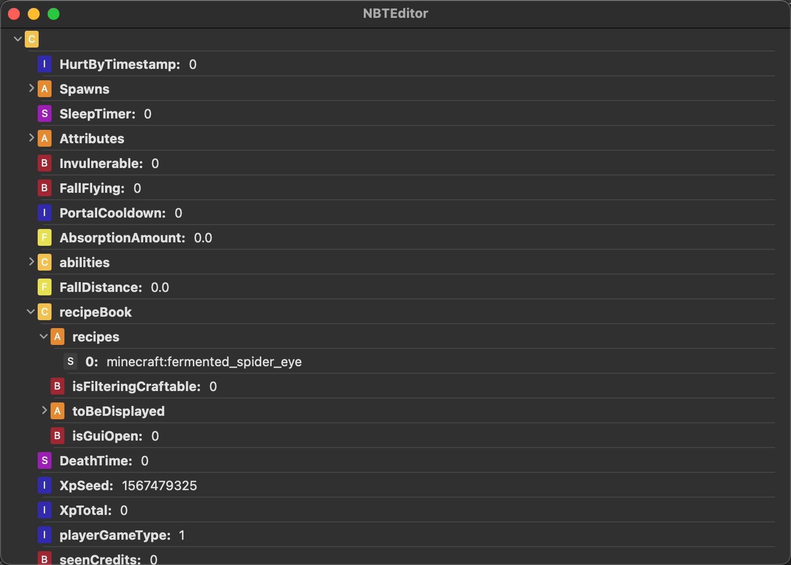

# NBTEditor

This is a MacOS application that allows users to read and edit NBT files in Minecraft.
If you find this project useful give me a Star.
**This project is still in development and all bug reports and feature requests are welcome.**

The goal of this project is:

- Complete

- Lightweight

- Friendly UI

## Download

This pre-released version can be found on the release page.

## To-Do

- [x] Read NBT

- [x] Edit Value

- [x] Rename

- [x] Delete Value

- [ ] Add Value

- [ ] Better UI

## Contribute

The contribution to this project is welcomed. If you have some suggestions or bug reports, please create an issue.

If you are a developer, feel free to create a PR with the issue with the mark `to-do` instead of `processing`

## Acknowledgement

Thanks for the contributor of the following library:

Swift-NBT [GitHub - ezfe/swift-nbt](https://github.com/ezfe/swift-nbt)
